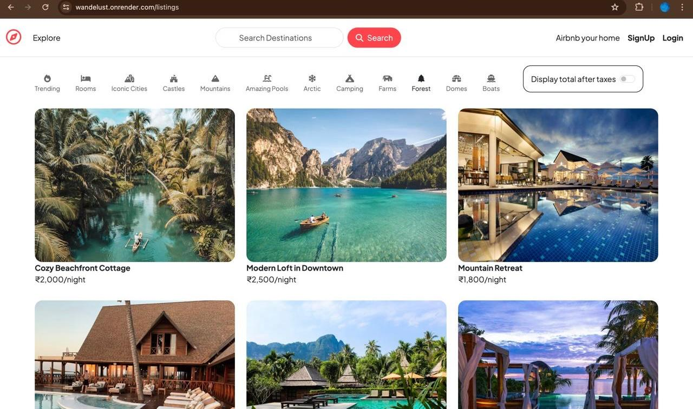
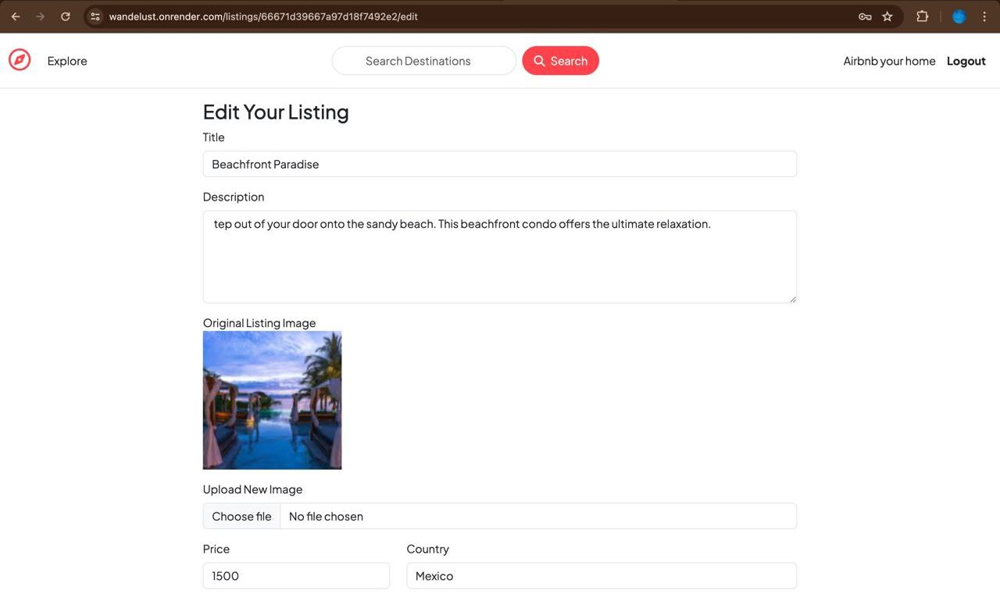
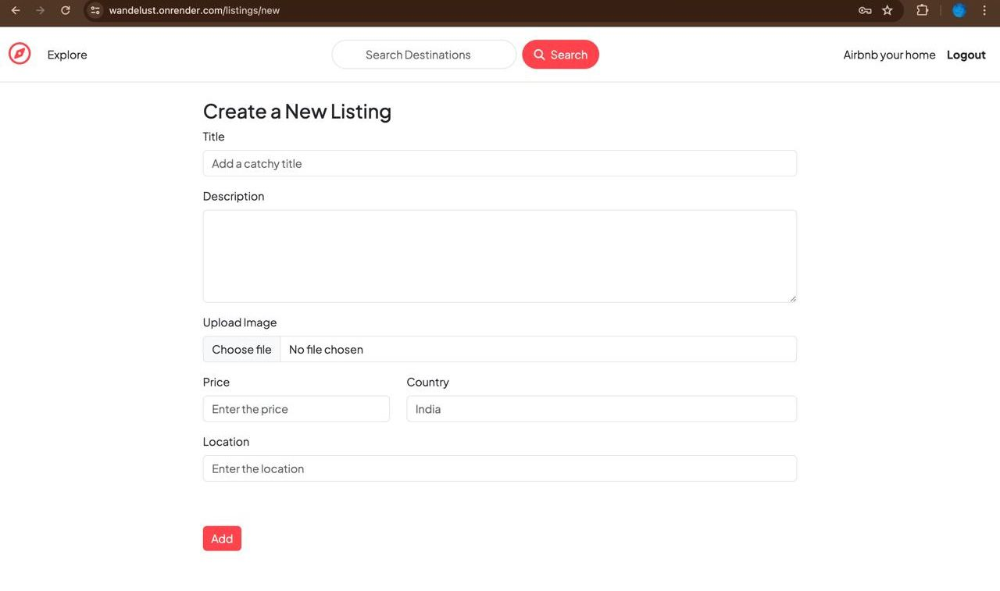
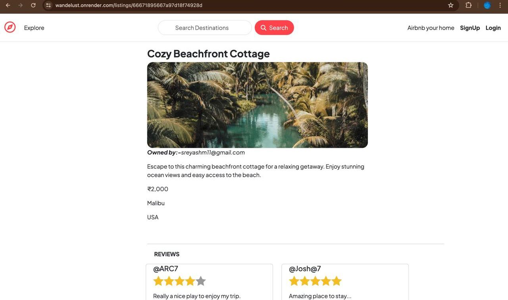
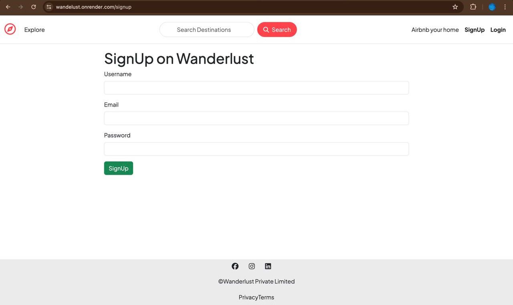

# Wanderlust - Airbnb Clone

Wanderlust is a full-stack Airbnb clone project that follows the Model-View-Controller (MVC) architecture. It provides essential functionalities for users to list, search, book accommodations, and leave reviews. The project utilizes modern technologies and services to ensure scalability, reliability, and user satisfaction.

## Key Features

### User Authentication
- Allows users to sign up, log in, and manage their accounts securely.
- Utilizes MongoDB as the primary database for storing user information.

### Listing Management
- Enables hosts to create, edit, and delete listings for properties they want to rent out.
- Integrates Cloudinary as the cloud storage solution for managing property images.

### Reviews and Ratings
- Allows users to leave reviews and ratings, fostering trust and transparency within the community.

### Full-Stack Implementation
- Developed using modern technologies including Node.js for the backend and MongoDB as the primary database.

### Session Management
- Utilizes MongoDB Atlas as the session store, ensuring efficient session handling and scalability.

### Deployment
- Deployed on Render for seamless hosting and scalability, ensuring high availability and performance.

## Technologies Used

### Frontend
- HTML/CSS
- JavaScript

### Backend
- Node.js
- Express.js

### Database
- MongoDB (MongoDB Atlas)

### Cloud Services
- Cloudinary

### Deployment
- Render

## Project Architecture

### Model-View-Controller (MVC)
- Follows a structured architectural pattern ensuring separation of concerns and scalability.

## Project Link

The project can be accessed [here](https://wandelust.onrender.com/listings).

## Screenshots

## Screenshots

## Skills Demonstrated

- Full-stack development
- MVC architecture
- MongoDB integration
- Cloudinary integration
- Deployment on Render
- User authentication and authorization
- Frontend and backend development using modern frameworks and technologies

